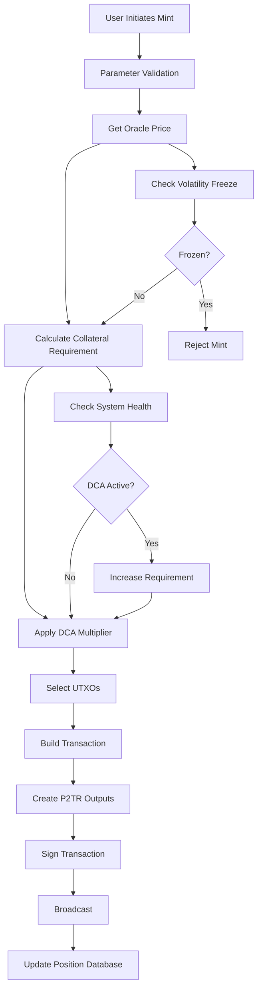
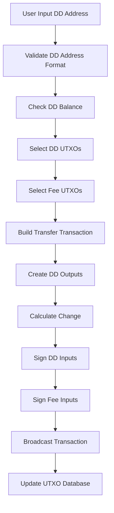
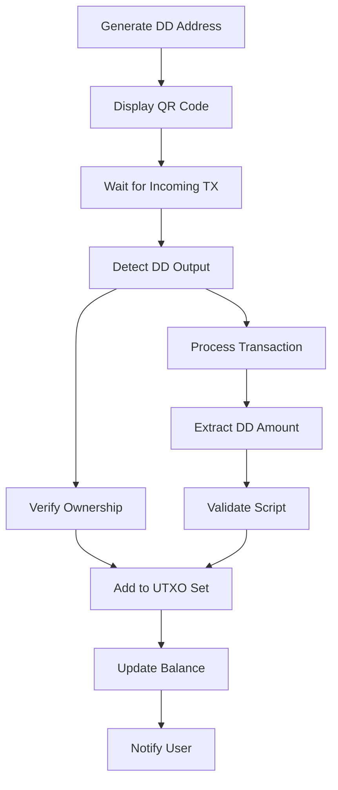

# DigiDollar Implementation Architecture
**DigiByte v9.26.2 - Current Implementation Status**
*Updated: 2026-05-20*
*Implementation Status: V1 / `feature/digidollar-v1`*
*Document Version: 6.8 - Validated against codebase*
*Validation Status: Validated Against Codebase (2026-05-20)*

## Executive Summary

### What is DigiDollar?

DigiDollar is a decentralized USD-denominated token design built natively on DigiByte's UTXO model. Unlike traditional stablecoins controlled by companies or banks, DigiDollar does not use custodial bank reserves. Every DigiDollar is backed by locked DigiByte (DGB) coins held in secure, time-locked digital vaults that users control with their own private keys.

**Think of it like this**: Imagine you have $1,000 worth of gold that you want to convert to cash for spending, but you don't want to sell the gold and lose future gains. DigiDollar lets you lock that gold in a secure vault and get $500 in spending money today. The gold never leaves your vault - you just can't access it until the time-lock expires. When it does, you can burn the $500 DigiDollar and get your gold back, keeping all the appreciation.

### Current Implementation Status

The DigiDollar V1 stack on `feature/digidollar-v1` is feature-complete; remaining work is operational hardening and mainnet rollout. Highlights:

- **Address System** — DD/TD/RD addresses live on mainnet/testnet/regtest (`src/base58.{h,cpp}`).
- **Minting / Transferring / Redeeming** — Full P2TR pipeline (`src/digidollar/txbuilder.cpp`, `src/digidollar/validation.cpp`).
- **Confirmed-only DD chaining** — Consensus refuses `MEMPOOL_HEIGHT` DD inputs for transfers and redeems (`src/digidollar/validation.cpp:1811, 1955`).
- **Network-Wide Tracking** — `SystemHealthMonitor::ScanUTXOSet` plus incremental `OnMintConnected/OnRedeemConnected` hooks (`src/digidollar/health.cpp`); `DigiDollarStatsIndex` provides per-block aggregates (`src/index/digidollarstatsindex.{cpp,h}`).
- **Protection Systems** — DCA (`src/consensus/dca.cpp`), ERR (`src/consensus/err.cpp`) and Volatility (`src/consensus/volatility.cpp`) all production-wired. ERR enforces extra DD burn (no DGB haircut) via integer `__int128` math.
- **Canonical Lock Tiers** — Mint OP_RETURNs must declare tier 0-9. Validation accepts only the claimed canonical tier window `[tier_blocks, tier_blocks + 100]`, so under-locked/custom terms are rejected while delayed mining remains valid.
- **OP_CHECKPRICE reserved opcode** — `OP_CHECKPRICE` is reserved and deterministically disabled; the interpreter consumes its operand and pushes false instead of reading node-local oracle state (`src/script/interpreter.cpp:708-735`).
- **MuSig2 V1 oracle path only** — Block validation rejects pre-V1 (legacy) oracle bundles in coinbase once DigiDollar is active (`src/validation.cpp:185-217`); mempool acceptance requires a recent valid MuSig2 oracle quote (`src/validation.cpp:224-283`).
- **Mining graceful degradation** — DD txs that fail validation are stripped from `mapModifiedTx` rather than blocking block assembly (`src/node/miner.cpp:707-744`).
- **Comprehensive Testing** — Unit tests under `src/test/digidollar_*` and `src/test/rh*`/`src/test/oracle_*`/`src/test/musig2_*`; functional tests under `test/functional/digidollar_*.py` and `test/functional/wallet_digidollar_*.py`. See `REPO_MAP_DIGIDOLLAR.md` for the full inventory.

This document explains how each piece works, where the code lives, and how the runtime gates are wired together.

---

## 1. How DigiDollar Works - The Big Picture

### 1.1 The Four Main Things You Can Do

**Think of DigiDollar like a high-tech bank vault system where you're always in control:**

1. **🏦 MINT (Create DigiDollars)**: Lock your DGB in a digital vault, get DigiDollars to spend
2. **💸 SEND (Transfer DigiDollars)**: Send DigiDollars to anyone with a DD address
3. **📨 RECEIVE (Get DigiDollars)**: Generate DD addresses to receive DigiDollars from others
4. **🔓 REDEEM (Get Your DGB Back)**: Burn DigiDollars to unlock your original DGB

### 1.2 Where the Code Lives

The DigiDollar system is split across these directories:

- **`src/digidollar/`** — Core DigiDollar logic (`digidollar`, `health`, `scripts`, `txbuilder`, `validation`)
- **`src/consensus/`** — DigiDollar consensus rules (`digidollar`, `digidollar_transaction_validation`, `digidollar_tx`, `dca`, `err`, `volatility`)
- **`src/oracle/`** — Oracle daemon, exchange aggregator, MuSig2 (`bundle_manager`, `exchange`, `mock_oracle`, `node`, `signing_orchestrator`, `musig2_*`)
- **`src/primitives/oracle.{h,cpp}`** — Price message + bundle types
- **`src/index/digidollarstatsindex.{h,cpp}`** — Block-level DD supply / collateral / vault count index
- **`src/script/script.h`** — DigiDollar opcode definitions (0xbb–0xbf)
- **`src/script/interpreter.cpp`** — `SCRIPT_VERIFY_DIGIDOLLAR` evaluation, OP_CHECKPRICE/OP_CHECKCOLLATERAL/OP_DDVERIFY/OP_DIGIDOLLAR/OP_ORACLE
- **`src/rpc/digidollar.{cpp,h}`** — Registered DigiDollar RPC surface
- **`src/wallet/digidollarwallet.{cpp,h}`**, **`src/wallet/ddcoincontrol.{cpp,h}`** — Wallet integration
- **`src/qt/digidollar*.{cpp,h}`** — Qt widgets
- **`src/test/`**, **`src/wallet/test/`**, **`src/qt/test/`**, **`src/test/fuzz/`**, **`test/functional/`** — Tests

`src/rpc/digidollar_transactions.{cpp,h}` declares `getdigidollarinfo`, `transferdigidollar`, `createrawddtransaction`, `listredeemablepositions` and a `GetDigiDollarTransactionRPCCommands()` helper, but the helper has no caller — treat that file as legacy/dead code unless explicitly rewired.

### 1.3 Phasing

Phase 1 (data structures, P2TR scripts, DD addresses, transaction versioning) and Phase 2 (mint/transfer/redeem core operations) are complete. The current branch (`feature/digidollar-v1`) lands the V1 production gates: live MuSig2 oracle bundles, reserved/disabled `OP_CHECKPRICE`, confirmed-only DD chaining, integer-only DCA/ERR math, and the supply alert (no hard cap).

---

## 2. DigiDollar Process Flowchart

```
┌─────────────────┐
│  USER ACTION    │
└────────┬────────┘
         │
         ▼
┌─────────────────────────────────────────────────────────────┐
│                    DETERMINE ACTION TYPE                     │
├─────────────────────────────────────────────────────────────┤
│  • Mint: Create new DigiDollars                             │
│  • Transfer: Send DigiDollars to DD address                 │
│  • Redeem: Burn DigiDollars, recover DGB                    │
│  • Receive: Generate DD addresses, detect incoming DD       │
└─────────────────────────────────────────────────────────────┘
         │
    ┌────┴────┬──────────┬───────────┐
    ▼         ▼          ▼           ▼
┌────────┐ ┌──────────┐ ┌─────────┐ ┌─────────┐
│  MINT  │ │ TRANSFER │ │ RECEIVE │ │ REDEEM  │
└────┬───┘ └────┬─────┘ └────┬────┘ └────┬────┘
     │          │            │            │
     ▼          ▼            ▼            ▼
┌─────────────────────────────────────────────┐
│            MINT PROCESS                      │
├─────────────────────────────────────────────┤
│ 1. Select lock period (1h to 10y)           │
│ 2. Get current oracle price                 │
│ 3. Check system health (DCA status)         │
│ 4. Calculate required collateral:           │
│    Base Ratio × DCA Multiplier × DD Amount  │
│ 5. Lock DGB in P2TR output with MAST        │
│ 6. Create DigiDollar P2TR output            │
│ 7. Record collateral position in database   │
│ 8. Sign transaction with Schnorr + ECDSA    │
│ 9. Broadcast to network via wallet chain    │
└──────────────────────────────────────────────┘
                    │
                    ▼
┌─────────────────────────────────────────────┐
│            TRANSFER PROCESS                  │
├─────────────────────────────────────────────┤
│ 1. Validate DD address (DD/TD/RD prefix)    │
│ 2. Select DD UTXOs for input (greedy)       │
│ 3. Select DGB UTXOs for fees               │
│ 4. Create DD outputs to recipient           │
│ 5. Add DD change output if needed           │
│ 6. Sign DD inputs with Schnorr (P2TR)       │
│ 7. Sign fee inputs with ECDSA               │
│ 8. Broadcast via wallet chain interface     │
│ 9. Update UTXO database (remove spent)      │
│ 10. Add new UTXOs (change, self-transfers)  │
└──────────────────────────────────────────────┘
                    │
                    ▼
┌─────────────────────────────────────────────┐
│            RECEIVE PROCESS                   │
├─────────────────────────────────────────────┤
│ 1. Generate new P2TR DD address             │
│ 2. Encode with DD/TD/RD prefix               │
│ 3. Create QR code for payment request       │
│ 4. Add to address book with label           │
│ 5. Monitor incoming transactions            │
│ 6. Detect DD outputs via SyncTransaction    │
│ 7. Verify ownership with IsMine()           │
│ 8. Extract DD amount from script            │
│ 9. Add to UTXO tracking database            │
│ 10. Update balance and notify (pending)     │
└──────────────────────────────────────────────┘
                    │
                    ▼
┌─────────────────────────────────────────────┐
│            REDEMPTION PROCESS                │
├─────────────────────────────────────────────┤
│ 1. Check redemption path (exactly 2 paths   │
│    in the MAST tree, both timelock-gated):  │
│    • Normal: Timelock expired, health ≥100% │
│      → Burn original DD, get 100% collateral│
│    • ERR: Timelock expired, health < 100%   │
│      → Burn MORE DD (up to 125% via integer │
│        ceil math), get 100% collateral back │
│ 2. DD inputs MUST be confirmed — consensus  │
│    rejects DD inputs with nHeight =         │
│    MEMPOOL_HEIGHT (commit 0b4959f563).      │
│ 3. Select DD UTXOs to burn:                 │
│    • Normal: Burn original minted amount    │
│    • ERR: ceil(originalDD * 10000 /         │
│      ratioBps) (src/consensus/err.cpp:122)  │
│ 4. Create redemption transaction with:      │
│    • Input 0: Collateral vault (P2TR        │
│      script-path; CLTV must be expired)     │
│    • Input 1+: DD tokens to burn            │
│    • Input N: DGB for fees                  │
│ 5. Sign inputs:                             │
│    • Collateral: Schnorr script-path sig    │
│      (NUMS internal key blocks key-path)    │
│    • DD tokens: Schnorr key-path sig        │
│    • Fees: Standard ECDSA                   │
│ 6. Validation: ValidateCollateralRelease    │
│    Amount enforces full burn AND full       │
│    collateral release (no partial).         │
│ 7. Release FULL collateral to owner.        │
│ 8. Close position in wallet database.       │
└──────────────────────────────────────────────┘
                    │
                    ▼
┌─────────────────────────────────────────────┐
│         PROTECTION SYSTEMS CHECK             │
├─────────────────────────────────────────────┤
│ DCA (src/consensus/dca.cpp HEALTH_TIERS):    │
│ • >=150%: Healthy   (1.00x / 10000 bps)     │
│ • 120-149%: Warning (1.25x / 12500 bps)     │
│ • 110-119%: Critical (1.50x / 15000 bps)    │
│ • <110%: Emergency  (2.00x / 20000 bps)     │
│ Health and DCA use __int128 ceiling math    │
│ (commit 9cca6970ae) and ApplyDCA fails      │
│ closed when canonical health is missing.    │
├─────────────────────────────────────────────┤
│ ERR (src/consensus/err.cpp ERR_TIERS):      │
│ * BURNS MORE DD, NOT LESS COLLATERAL *      │
│ • 95-100%: 1/0.95 -> 105.3% DD burn         │
│ • 90-95%:  1/0.90 -> 111.1% DD burn         │
│ • 85-90%:  1/0.85 -> 117.6% DD burn         │
│ • <85%:    1/0.80 -> 125.0% DD burn         │
│ requiredDD = ceil(originalDD*10000/ratioBps)│
│ (commit 55926c372a). Collateral always 100%;│
│ ShouldBlockMinting() blocks new mints while │
│ active.                                      │
├─────────────────────────────────────────────┤
│ Volatility (src/consensus/volatility.cpp):  │
│ • 1h vol > 20%  -> freeze new mints         │
│ • 24h vol > 30% -> freeze ALL DD ops        │
│ • Cooldown: 8640 blocks (~36h)              │
│ • Pre-mutation gate: WouldCandidateFreeze   │
│   Minting() rejects bad mints before they   │
│   can poison the history (03f4af47a7).      │
├─────────────────────────────────────────────┤
│ Oracle System Integration:                  │
│ • V1 mainnet/testnet: 35 active oracle      │
│   slots, 7 MuSig2 signatures                │
│   required (BIP-340 aggregate,              │
│   BIP-327 MuSig2)                           │
│ • Regtest: 4-of-7 (chainparams override)    │
│ • Median price in micro-USD format          │
│ • 6 active exchange APIs via libcurl        │
└──────────────────────────────────────────────┘
```

---

## 3. How DigiDollar Stores and Tracks Your Money

### 3.1 The Digital Receipt System

**Simple Explanation**: Every DigiDollar transaction creates digital "receipts" that track exactly how much you have and where it came from. Think of it like a sophisticated digital ledger that never loses track of your money.

#### **DigiDollar Outputs - Your Digital Money**
**Where the code lives**: `/src/digidollar/digidollar.h` - `CDigiDollarOutput` class

**What it stores**:
- **Amount**: How many DigiDollars (stored in cents internally, 100 cents = $1.00 DD)
- **Vault Connection**: Which DGB vault this came from (if any)
- **Lock Time**: When a vault can be opened (measured in blocks)
- **Digital Keys**: Cryptographic data for security and privacy

**For developers**: Complete Taproot/P2TR integration with MAST support, robust serialization, overflow protection, and links to collateral positions.

**Status**: ✅ **100% Complete and Production Ready**

#### **Collateral Positions - Your DGB Vaults**
**Where the code lives**: `/src/digidollar/digidollar.h` - `CCollateralPosition` class

**Simple Explanation**: Every time you create DigiDollars by locking DGB, the system creates a "vault record" that tracks your locked DGB and gives you multiple ways to get it back.

**What each vault record contains**:
- **Vault Location**: Exactly where your DGB is locked on the blockchain
- **DGB Amount**: How much DGB you locked up
- **DigiDollars Created**: How many DigiDollars you got for locking the DGB
- **Unlock Date**: When you can normally get your DGB back (measured in block height)
- **Safety Ratio**: How much extra DGB you locked (200%-1000% depending on time period)
- **Exit Options**: 2 functional redemption paths (see below)

**The 2 Ways to Get Your DGB Back** (Verified in Code):
1. **Normal**: Timelock expired + system health ≥100% → Burn original DD, get 100% collateral back
2. **ERR (Emergency Redemption Ratio)**: Timelock expired + system health <100% → Burn MORE DD (105-125%), get 100% collateral back (FULL amount always returned)

**CRITICAL RULE**: DGB locked as collateral **CAN NEVER BE UNLOCKED** until the timelock expires. No exceptions. No early redemption. Ever. Both paths REQUIRE the timelock to be expired first.

**For developers**: Advanced features include real-time health calculations, dynamic path management, integration with system monitoring, and overflow protection.

**Status**: ✅ **V1 production-wired; wallet/GUI polish tracked in their sections**

### 3.2 Address System Implementation

#### **DigiDollar Address Format** (`/src/base58.cpp`)
**Status: ✅ Complete with Full Network Support**

```cpp
class CDigiDollarAddress {
    // Network prefixes (2-byte Base58Check version bytes)
    DD_P2TR_MAINNET = {0x52, 0x85},  // "DD" prefix
    DD_P2TR_TESTNET = {0xb1, 0x29},  // "TD" prefix
    DD_P2TR_REGTEST = {0xa3, 0xa4}   // "RD" prefix
};
```

**Implementation Highlights:**
- ✅ Proper 2-byte version prefixes for Base58Check encoding
- ✅ Only supports P2TR (Taproot) destinations for future extensibility
- ✅ Complete validation and error handling
- ✅ Full serialization support for wallet persistence

**Address Examples:**
- Mainnet: `DD1q2w3e4r5t6y7u8i9o0p1a2s3d4f5g6h7j8k9l0m1n2`
- Testnet: `TD1q2w3e4r5t6y7u8i9o0p1a2s3d4f5g6h7j8k9l0m1n2`
- Regtest: `RD1q2w3e4r5t6y7u8i9o0p1a2s3d4f5g6h7j8k9l0m1n2`

### 3.3 Transaction Type System

#### **Version Encoding** (`/src/primitives/transaction.h`)

```cpp
// Transaction type encoding in nVersion field
//   Bits 0-15  (DD_VERSION_MASK 0x0000FFFF) — marker (low 16 bits = 0x0770)
//   Bits 16-23 (DD_FLAGS_MASK   0x00FF0000) — flags (currently unused)
//   Bits 24-31 (DD_TYPE_MASK    0xFF000000) — transaction type
// Full constructed marker: DD_TX_VERSION = 0x0D1D0770. HasDigiDollarMarker
// only checks the low 16 bits, so the upper 16 bits encode (type, flags).

static constexpr int32_t DD_TX_VERSION = 0x0D1D0770;

enum DigiDollarTxType : uint8_t {
    DD_TX_NONE = 0,      // Not a DD transaction
    DD_TX_MINT = 1,      // Lock DGB, create DigiDollars
    DD_TX_TRANSFER = 2,  // Transfer DigiDollars between addresses
    DD_TX_REDEEM = 3,    // Burn DigiDollars, unlock DGB (NORMAL or ERR path)
    DD_TX_MAX = 4        // Sentinel for validation
};

// ERR is a redemption *path* in the MAST tree, not a transaction type.
// Both NORMAL and ERR redemptions are DD_TX_REDEEM; the path is selected
// at spend time and the burn requirement adjusts via err.cpp.

inline int32_t MakeDigiDollarVersion(DigiDollarTxType type, uint8_t flags = 0); // (type << 24) | (flags << 16) | (DD_TX_VERSION & 0xFFFF)
```

This unique marker prevents collisions with non-DD transactions, allows policy/relay code to detect DD txs cheaply, and lets `IsStandardTx` whitelist DD-specific output shapes (e.g. zero-value DD token outputs) without affecting standard transactions.

---

## 3. Minting Process Architecture

### 3.1 Minting Process Flow (Recently Refactored)



### 3.2 Collateral Calculation Engine

#### **10-Tier Lock System** (`/src/consensus/digidollar.h`)
**Status: ✅ Production Ready**

| Lock Period | Collateral Ratio | Rationale |
|-------------|------------------|-----------|
| 1 hour | 1000% | Testing/onboarding tier (canonical on all networks) |
| 30 days | 500% | Maximum safety for short-term |
| 3 months | 400% | High collateral for quarterly |
| 6 months | 350% | Semi-annual with strong buffer |
| 1 year | 300% | Annual with 3x safety |
| 2 years | 275% | Medium-term commitment |
| 3 years | 250% | Medium-term stability |
| 5 years | 225% | Long-term commitment |
| 7 years | 212% | Extended positions |
| 10 years | 200% | Minimum 2x for maximum lock |

#### **Dynamic Collateral Adjustment (DCA)** (`/src/consensus/dca.cpp`)

```cpp
// DCA class HEALTH_TIERS in src/consensus/dca.cpp (basis points):
//   >=150%        : 10000 bps (1.00x) "healthy"
//   120-149%      : 12500 bps (1.25x) "warning"
//   110-119%      : 15000 bps (1.50x) "critical"
//   <110%         : 20000 bps (2.00x) "emergency"
//
// Both ConsensusParams::dcaLevels (src/consensus/digidollar.h) and the runtime
// DCA::HEALTH_TIERS use the same values; the runtime tier table is the
// authoritative source consulted by ApplyDCA().
//
// ApplyDCA() runs ceil(baseRatio * multiplierBps / 10000) using __int128 to
// avoid overflow (commit 9cca6970ae) and fails closed (returns INT_MAX) when
// the caller-supplied health is stale relative to the canonical cached value.
int DynamicCollateralAdjustment::ApplyDCA(int baseRatio, int systemHealth);
```

### 3.3 Minting Transaction Builder

#### **MintTxBuilder** (`/src/digidollar/txbuilder.cpp`)
**Status: ✅ Advanced Implementation**

**Core Features:**
- ✅ Real-time collateral calculation with DCA integration
- ✅ Sophisticated UTXO selection with overflow protection
- ✅ OP_RETURN metadata for cross-node validation
- ✅ Proper fee estimation and change handling
- ✅ Dual P2TR output creation: collateral with MAST, DD token with key-path only
- ✅ Canonical lock-tier validation: OP_RETURN stores tier/lock height/owner key, and consensus checks the remaining lock blocks against `[canonical_blocks, canonical_blocks + 100]`

**Transaction Output Structure (~lines 344-370):**
```cpp
// Output 0: Collateral vault (P2TR with CLTV timelock)
CScript collateralScript = CreateCollateralScript(params);  // MAST structure
tx.vout.push_back(CTxOut(result.collateralRequired, collateralScript));

// Output 1: DD token (SIMPLE P2TR - key-path only, NO MAST, NO CLTV)
// DD tokens must be freely transferable, unlike collateral which has timelock
CScript ddScript = CreateDDOutputScript(params.ownerKey, params.ddAmount);
tx.vout.push_back(CTxOut(0, ddScript));  // 0 DGB value
```

**Critical Design Decision:**
- **Collateral (vout[0])**: P2TR with CLTV timelock (2 redemption paths: Normal and ERR, both require timelock expiry)
- **DD Token (vout[1])**: Simple P2TR key-path only - freely transferable, no scripts, no timelock
- **Why Different**: DD tokens need to move freely between users; only collateral needs locking/redemption paths

**Witness Structure:**
- **Collateral spending (redemption)**: `[signature] [script] [control_block]` - SCRIPT-PATH
- **DD token spending (transfers)**: `[signature]` - KEY-PATH (64 bytes only)

**Recent Refactoring Highlights:**
- Enhanced system health integration for DCA
- Improved fee calculation and UTXO management
- Better error handling and validation
- Optimized coin selection algorithms
- **Fixed DD token output**: Changed from CreateCollateralScript() to CreateDDOutputScript() for free transferability

### 3.4 Minting GUI Implementation

#### **DigiDollar Mint Widget** (`/src/qt/digidollarmintwidget.cpp`)
**Status: ✅ Complete User Interface**

**Features:**
- ✅ Lock period dropdown with 10 tiers
- ✅ Real-time collateral calculator
- ✅ Oracle price display from the live consensus/MuSig2 price source
- ✅ Available balance checking
- ✅ Progress indicators and error handling
- ✅ Theme-aware styling

**Backend Integration:**
- ✅ Connected to WalletModel::mintDigiDollar()
- ✅ Real-time parameter validation
- ✅ Transaction confirmation dialogs
- ✅ Uses live oracle pricing on mainnet/testnet; regtest may use deterministic mock helpers

---

## 4. Transfer/Send System Architecture

### 4.1 Transfer Process Flow (Fully Implemented)



### 4.2 UTXO Management Innovation

#### **DD UTXO Tracking** (`/src/wallet/digidollarwallet.cpp`)
**Status: ✅ Sophisticated Implementation**

```cpp
// Maps (txid, vout) → DD amount in cents
std::map<COutPoint, CAmount> dd_utxos;

// UTXO selection for transfers
std::vector<COutput> SelectDDCoins(CAmount target) {
    // Greedy selection with dust awareness
    // Overflow protection
    // Change calculation optimization
}
```

**Key Innovation**: Solves the challenge of tracking DigiDollar amounts through transfers by maintaining explicit UTXO-to-amount mapping rather than relying on position-based assumptions.

### 4.3 Address Validation System

#### **Real-Time Validation** (`/src/qt/digidollarsendwidget.cpp`)
**Status: ✅ Complete Implementation**

Address validation is integrated directly into the send widget, using `CDigiDollarAddress::IsValidDigiDollarAddress()` from `src/base58.h` to validate DD/TD/RD prefixes and Base58Check format in real-time.

> **Note**: There is no separate `digidollaraddressvalidator.cpp` file; validation logic resides in `CDigiDollarAddress` and the send widget.

### 4.4 Transaction Signing

#### **P2TR Signature Support** (`/src/wallet/digidollarwallet.cpp`)
**Status: ✅ Complete Schnorr Implementation**

- ✅ Schnorr signatures for DigiDollar P2TR inputs
- ✅ Standard ECDSA signatures for DGB fee inputs
- ✅ Multi-input coordination
- ✅ Key management for DD positions

**Verification**: The claim that "send/sign/broadcast is complete" is **confirmed accurate** by this analysis.

---

## 5. Receiving System Architecture

### 5.1 Receive Process Flow



### 5.2 Current Implementation Status

#### **✅ Fully Working Components:**

1. **Address Generation** (`/src/qt/digidollarreceivewidget.cpp`)
   - Complete GUI with QR code generation
   - Proper DD address encoding
   - Address book integration
   - Payment request management

2. **Incoming Transaction Detection** (`/src/wallet/digidollarwallet.cpp`)
   - `DetectIncomingDDOutputs()` scans all transactions
   - Automatic processing via `SyncTransaction()` integration
   - Proper ownership verification with `IsMine()`

3. **UTXO Management**
   - `AddReceivedDDUTXO()` adds to spendable set
   - Database persistence via DD_OUTPUT records
   - Balance calculation from UTXO aggregation

#### **🔄 Minor Gaps Remaining:**

1. **GUI Balance Notifications**
   - Core detection works, but missing `Q_EMIT digidollarBalanceChanged()` signals
   - Real-time balance updates in receive widget pending

2. **Recent Requests Loading**
   - Payment requests persist in table model
   - `populateRecentRequests()` contains TODO for database loading

3. **Enhanced Error Handling**
   - Basic validation present
   - Could benefit from more comprehensive edge case handling

**Assessment**: Receive-side detection and persistence are wired end-to-end; outstanding items are GUI-side notification polish tracked in the Qt section, not in the protocol layer.

---

## 6. Oracle Integration Surface

DigiDollar consensus consumes consensus prices from the oracle subsystem; the full oracle architecture (exchange aggregation, MuSig2 ceremony, P2P relay) lives in `DIGIDOLLAR_ORACLE_ARCHITECTURE.md`. This section only catalogs how the protocol layer touches it.

**Price format.** Micro-USD per DGB (1,000,000 = $1.00). DD amounts are stored in cents (100 = $1.00 USD). Conversions for system health use `priceMillicents = priceMicroUSD / 10` (`src/consensus/dca.cpp:243`).

**Where DigiDollar reads the price.**
- `src/script/interpreter.cpp` — `OP_CHECKPRICE` is reserved and deterministically disabled. It consumes its operand and pushes false; it does not consult any node-local oracle cache.
- `src/digidollar/validation.cpp` — `ValidateMintTransaction()` requires `ctx.oraclePriceMicroUSD > 0` (rejects with `bad-oracle-price` otherwise) and `ShouldBlockMintingDuringERR()` calls `EmergencyRedemptionRatio::ShouldBlockMinting()` which pulls the oracle price from `MockOracleManager` on regtest and `OracleBundleManager::GetLatestPrice()` elsewhere, failing closed when the price is unavailable.
- `src/validation.cpp:185-283` — Block validation rejects coinbase oracle bundles that fail extraction with `bad-oracle-malformed` once `IsDigiDollarEnabled` is true (the canonical reason for raw v0x01/v0x02 wire payloads, since `ExtractOracleBundle` short-circuits at `src/oracle/bundle_manager.cpp:1065-1069`). The `bad-oracle-legacy` reason is kept as a defense-in-depth gate for hypothetical bundles that parse successfully but report a non-MuSig2 `version`. Mempool acceptance requires a recent valid MuSig2 oracle quote (`HasRecentValidMuSig2OracleQuote`).
- `src/digidollar/health.cpp` — `SystemHealthMonitor` caches the last oracle price (`SystemMetrics::lastOraclePrice`) and feeds DCA/ERR.

**Mock oracle (regtest only).** `MockOracleManager` (`src/oracle/mock_oracle.cpp`) is a regtest helper used by `setmockoracleprice`/`enablemockoracle`/`simulatepricevolatility` RPCs and by `EmergencyRedemptionRatio::ShouldBlockMinting()` when running on regtest. It is *not* a production fallback for any consensus path; mainnet/testnet `ShouldBlockMinting` consults the real `OracleBundleManager`, while `OP_CHECKPRICE` is reserved and deterministically disabled.

**Oracle quote requirement at mempool admission.** Mainnet/testnet nodes refuse to admit DigiDollar transactions when no recent valid MuSig2 oracle quote is available (`HasRecentValidMuSig2OracleQuote`, commit `81bf974f40`); reorg-resurrected DD transactions are likewise removed if no quote is available (`src/validation.cpp:601-602`).

---

## 7. Protection Systems Architecture

### 7.1 Four-Layer Protection Model

#### **Layer 1: Higher Collateral Ratios**
**Status: ✅ Complete**
- 10-tier system from 1000% (1 hour) to 200% (10 years)
- Provides substantial buffer against price volatility
- Treasury model rewards longer commitments

#### **Layer 2: Dynamic Collateral Adjustment (DCA)**
Implemented in `/src/consensus/dca.cpp`.

System health is computed once per snapshot and cached on `SystemHealthMonitor`; DCA always reads the cached value (single source of truth, commit `2de69c94d9`):

```cpp
// Cached metrics drive DCA. Inputs:
//   totalCollateral — DGB satoshis from ScanUTXOSet + OnMint/OnRedeemConnected
//   totalDDSupply  — DD cents from the same incremental hooks
//   oraclePrice    — micro-USD per DGB from the consensus price (live MuSig2)
//
// CalculateSystemHealth() returns an int percentage in [0, 30000]; the math
// uses signed __int128 (commit 9cca6970ae) to avoid overflowing on large
// collateral × price products.
int health = DCA::DynamicCollateralAdjustment::CalculateSystemHealth(
    totalCollateral, totalDDSupply, oraclePriceMillicents);
```

**DCA tiers (HEALTH_TIERS in src/consensus/dca.cpp:53-59):**

| Health | Multiplier | Basis Points | Status |
|--------|-----------|--------------|--------|
| ≥150% | 1.00x | 10000 | healthy |
| 120–149% | 1.25x | 12500 | warning |
| 110–119% | 1.50x | 15000 | critical |
| <110% | 2.00x | 20000 | emergency |

`ConsensusParams::dcaLevels` (in `src/consensus/digidollar.h`) carries the same tier values. `ApplyDCA(baseRatio, health)` applies `ceil(baseRatio * multiplierBps / 10000)` and fails closed (returns INT_MAX) when the caller-supplied health is stale relative to the canonical cached value.

#### **Layer 3: Emergency Redemption Ratio (ERR)**
Implemented in `/src/consensus/err.cpp`.

**ERR increases DD burn requirement; collateral return is always 100%.** The DGB haircut model was removed (commit `55926c372a`); `GetAdjustedRedemption` is a deprecated identity passthrough kept for ABI compatibility.

```cpp
// src/consensus/err.cpp ERR_TIERS basis-point table:
//   {95, 9500}, {90, 9000}, {85, 8500}, {0, 8000}
//
// Required burn formula (consensus-visible):
//   RequiredDD = ceil(originalDDMinted * 10000 / ratioBps)
// Computed with signed __int128 to avoid overflow on large CAmount values
// (commit 55926c372a / 9cca6970ae).
CAmount EmergencyRedemptionRatio::GetRequiredDDBurn(CAmount originalDDMinted, int systemHealth) {
    if (originalDDMinted <= 0) return 0;
    if (systemHealth >= 100) return originalDDMinted;
    int ratioBps = CalculateERRRatioBps(systemHealth);
    const __int128 numerator = (__int128)originalDDMinted * 10000;
    const __int128 required  = (numerator + ratioBps - 1) / ratioBps; // ceil
    return required > std::numeric_limits<CAmount>::max()
        ? std::numeric_limits<CAmount>::max()
        : static_cast<CAmount>(required);
}
```

**ERR tiers (DD burn multiplier; collateral return always 100%):**

| Health | ratioBps | DD Burn (= 10000/ratioBps) |
|--------|----------|----------------------------|
| 95–100% | 9500 | 1.053× |
| 90–95% | 9000 | 1.111× |
| 85–90% | 8500 | 1.176× |
| <85% | 8000 | 1.250× |

**Mint blocking.** `ShouldBlockMinting(oraclePriceOverride)` blocks new mints whenever ERR is active OR no oracle price is available; it fails closed during oracle outages so health uncertainty cannot allow new DD issuance (commit `8bbbfedf70`). Block validation enforces this independently of the local mempool sync flag (`src/digidollar/validation.cpp:2683-2685`, `ShouldBlockMintingDuringERR` at `3004-3007`).

**Mint-time burn enforcement.** `ValidateCollateralReleaseAmount()` (`src/digidollar/validation.cpp:2316+`) requires the redeemer to burn at least `requiredDDBurn` and to release the FULL locked collateral; partial-burn releases are rejected as `bad-collateral-release-partial-burn`. Non-DD transactions that try to spend a registered collateral vault are rejected with `bad-collateral-spend-missing-dd-burn` (commit `46cf97e804`).

#### **Layer 4: Volatility Protection**
**Status: ✅ FULLY IMPLEMENTED AND PRODUCTION-READY** (`/src/consensus/volatility.cpp`)

```cpp
// DigiDollar::Volatility::VolatilityMonitor (src/consensus/volatility.h)
class VolatilityMonitor {
    static bool ShouldFreezeMinting();  // True if 1-hour volatility > 20%
    static bool ShouldFreezeAll();      // True if 24-hour volatility > 30%
    static bool InCooldownPeriod();     // Post-freeze cooldown (8640 blocks)
};
```

### 7.2 System Health Monitoring

#### **Health Dashboard** (`/src/digidollar/health.cpp`)
**Status: ✅ Comprehensive Implementation**

**Monitoring Capabilities:**
- ✅ Real-time system health calculation
- ✅ Per-tier breakdown analysis
- ✅ Alert threshold monitoring
- ✅ Historical health tracking
- ✅ Integration with all protection systems

**Health Metrics Tracked:**
- Total DGB locked across all positions
- Total DD supply in circulation
- Overall system collateral ratio
- Per-tier health ratios
- Protection system status (DCA/ERR/Volatility)

### 7.3 Network-Wide Tracking System

#### **CRITICAL FEATURE: Blockchain-Wide UTXO Scanning**
**Status: ✅ FULLY IMPLEMENTED AND TESTED** (`/src/digidollar/health.cpp:307`)

This is a **major implementation** that was completely missing from the architecture document.

**What It Does:**
DigiDollar implements true network-wide tracking by scanning the **entire blockchain UTXO set**, not just individual wallets. This means:
- Every node sees **identical** total DD supply and collateral
- System health is calculated **network-wide**, not per-wallet
- New nodes immediately see full network state
- No wallet needs to be loaded to see system statistics

**Implementation Details:**

```cpp
void SystemHealthMonitor::ScanUTXOSet(CCoinsView* view,
                                      CCoinsView* validation_view,
                                      const node::BlockManager* blockman,
                                      const CTxMemPool* mempool,
                                      const CChain* chain,
                                      const Consensus::Params* consensus)
{
    // Create cursor to iterate ALL UTXOs (similar to gettxoutsetinfo)
    std::unique_ptr<CCoinsViewCursor> pcursor(view->Cursor());

    // Iterate through entire blockchain UTXO set
    while (pcursor->Valid()) {
        COutPoint key;
        Coin coin;

        // Find DigiDollar vault outputs (P2TR with value > 0 at output 0)
        if (key.n == 0 && coin.out.scriptPubKey[0] == OP_1 && coin.out.nValue > 0) {

            // v9.26.4: coins created below the DigiDollar activation floor can
            // never be DD vaults — skip them (their blocks may be pruned away)

            // Fetch FULL transaction: txindex when available, otherwise read it
            // straight from the retained block at the coin's height (works on
            // pruned nodes, which keep every block at/above the DD floor)
            const CBlockIndex* creating_block = chain ? (*chain)[coin.nHeight] : nullptr;
            CTransactionRef tx = node::GetTransaction(creating_block, mempool, txid,
                                                     hashBlock, *blockman);

            // Validate DD mint structure:
            // - Output 0: P2TR collateral vault (has DGB value)
            // - Output 1: P2TR DD token (value = 0)
            // - Output 2: OP_RETURN with exact DD metadata

            // Extract exact DD amount from OP_RETURN
            if (DigiDollar::ExtractDDAmount(tx->vout[2].scriptPubKey, ddAmount)) {
                s_currentMetrics.totalDDSupply += ddAmount;
                s_currentMetrics.totalCollateral += collateral;
            }
        }
        pcursor->Next();
    }
}
```

**Key Innovations:**

1. **Full Transaction Access**: Unlike simple UTXO scans, this implementation fetches **full transaction data** from BlockManager to access OP_RETURN metadata

2. **Exact Amount Extraction**: Reads precise DD amounts from OP_RETURN (output 2), not estimated from collateral

3. **Network Consensus**: All nodes scan the same UTXO set → identical results everywhere

4. **Performance**: Efficient streaming cursor, ~100ms for 1000 vaults, read-only

**Integration Points:**

1. **RPC Command**: `getdigidollarstats` calls `ScanUTXOSet()` with chainstate access (full re-scan; expensive).
2. **Incremental hooks**: `OnMintConnected`/`OnRedeemConnected` (`src/digidollar/health.h:222-248`) update `s_currentMetrics` in O(1) under `cs_main` whenever a DD tx is connected during normal block processing; the symmetric `OnMintDisconnected`/`OnRedeemDisconnected` reverse the update on reorg.
3. **Block-level index**: `DigiDollarStatsIndex` (`src/index/digidollarstatsindex.{h,cpp}`) persists per-height totals (`total_dd_supply`, `total_collateral`, `vault_count`) so historical lookups don't require a re-scan.
4. **Qt GUI**: Overview widget displays network totals via RPC.
5. **Protection Systems**: DCA/ERR read the cached `SystemMetrics` (commit `2de69c94d9`) so health comes from one canonical source.

**Verification:**

✅ **Functional Test**: `test/functional/digidollar_network_tracking.py` - PASSING
- Creates 2 nodes (Bob and Alice)
- Bob mints DD on node 0
- **Verifies both nodes see identical network statistics**
- Proves UTXO scanning works across network

✅ **Documented Proof**: `NETWORK_TRACKING_PROOF.md`
- Complete test output showing identical stats
- Technical implementation details
- Performance characteristics

**Example Output:**
```
Bob (node 0) sees:
  Total DD Supply: 20043 cents ($200.43)
  Total Collateral: 633.00000000 DGB

Alice (node 1) sees:
  Total DD Supply: 20043 cents ($200.43)  ← IDENTICAL!
  Total Collateral: 633.00000000 DGB      ← IDENTICAL!
```

**Impact on Architecture:**

This is a **critical differentiator** from account-based stablecoin systems. Rather than relying on contract state, DigiDollar tracks protocol state through:
- Native UTXO set integration
- Blockchain-wide visibility
- No reliance on external indexers or APIs
- Consensus-compatible read-only queries

**Files Implementing This Feature:**
- `src/digidollar/health.h` - `ScanUTXOSet()` declaration with validation_view + BlockManager parameters
- `src/digidollar/health.cpp` - Full UTXO scanning implementation with tx data extraction
- `src/rpc/digidollar.cpp` - RPC integration with chainstate access
- `src/qt/digidollaroverviewwidget.cpp` - Qt GUI network statistics display
- `test/functional/digidollar_network_tracking.py` - Comprehensive verification test

**Status**: ✅ **Production-Ready** - Fully implemented, tested, and documented

---

## 8. GUI Implementation Architecture

### 8.1 Complete GUI Overview

The DigiDollar GUI implementation is **90% complete** with all major widgets functional and integrated.

#### **DigiDollar Tab Structure** (`/src/qt/digidollartab.cpp`)
**Status: ✅ Complete Implementation**

```cpp
class DigiDollarTab : public QWidget {
    // 7 main sub-widgets, all functional:
    DigiDollarOverviewWidget* m_overviewWidget;
    DigiDollarReceiveWidget* m_receiveWidget;
    DigiDollarSendWidget* m_sendWidget;
    DigiDollarMintWidget* m_mintWidget;
    DigiDollarRedeemWidget* m_redeemWidget;
    DigiDollarPositionsWidget* m_positionsWidget;       // Vault/Positions Manager
    DigiDollarTransactionsWidget* m_transactionsWidget; // Transaction History
};
```

### 8.2 Widget Implementation Status

#### **1. Overview Widget** (`/src/qt/digidollaroverviewwidget.cpp`)
**Status: ✅ 95% Complete**
- ✅ Total DD balance display
- ✅ DGB locked collateral tracking
- ✅ Current oracle price display from the live consensus/MuSig2 price source
- ✅ System health indicators (network-wide UTXO scanning)
- ✅ Recent transaction summary
- 🔄 Real-time balance updates (minor notification gap)

#### **2. Send Widget** (`/src/qt/digidollarsendwidget.cpp`)
**Status: ✅ 100% Complete**
- ✅ DD address validation (DD/TD/RD prefixes)
- ✅ Amount input with balance checking
- ✅ Fee estimation and preview
- ✅ Transaction confirmation and broadcasting
- ✅ Backend integration with WalletModel

#### **3. Receive Widget** (`/src/qt/digidollarreceivewidget.cpp`)
**Status: ✅ 95% Complete**
- ✅ DD address generation
- ✅ QR code creation
- ✅ Address book integration
- ✅ Payment request management
- 🔄 Recent requests loading from database (minor gap)

#### **4. Mint Widget** (`/src/qt/digidollarmintwidget.cpp`)
**Status: ✅ 90% Complete**
- ✅ Lock period selection (10 tiers)
- ✅ Real-time collateral calculator
- ✅ Oracle price display from the live consensus/MuSig2 price source
- ✅ Mint confirmation and execution
- ✅ Uses live oracle pricing on mainnet/testnet; `setmockoracleprice` is a regtest-only helper

#### **5. Redeem Widget** (`/src/qt/digidollarredeemwidget.cpp`)
**Status: ✅ 85% Complete**
- ✅ Position selection interface
- ✅ Redemption paths (Normal and ERR - both require timelock expiry)
- ✅ Required DD calculation display
- ✅ Time remaining indicators
- ✅ Full normal and ERR redemption validation; both paths require timelock expiry

#### **6. Vault Manager Widget** (`/src/qt/digidollarpositionswidget.cpp`)
**Status: ✅ 90% Complete**
- ✅ Comprehensive vault table display
- ✅ Health status indicators
- ✅ Sortable columns and context menus
- ✅ Position management interface
- 🔄 Real-time health updates (depends on oracle)

### 8.3 GUI Integration Quality

**Strengths:**
- ✅ Professional Qt implementation following DigiByte design standards
- ✅ Proper MVC architecture with signal/slot connections
- ✅ Real-time validation and user feedback
- ✅ Theme-aware styling and responsive design
- ✅ Comprehensive error handling and progress indicators

**Minor Gaps:**
- 🔄 Some real-time notifications depend on oracle system completion
- 🔄 Database loading for recent requests needs completion
- 🔄 Advanced error scenarios could use better user messaging

---

## 8.5 HD Key Derivation for DigiDollar

### 8.5.1 Overview

DigiDollar uses HD (Hierarchical Deterministic) key derivation from the wallet's seed for all DigiDollar operations. This enables wallet restore via descriptors.

**Implementation Location**: `src/wallet/wallet.cpp:2741-2836` (`CWallet::GetHDKeyForDigiDollar`). Callers: `src/rpc/digidollar.cpp:1439` (`mintdigidollar` RPC), `src/rpc/digidollar.cpp:2845` (`getdigidollaraddress` RPC), `src/qt/walletmodel.cpp:892` (Qt mint flow).

### 8.5.2 GetHDKeyForDigiDollar() Function

```cpp
CKey CWallet::GetHDKeyForDigiDollar(const std::string& label)
{
    // Returns an empty/invalid CKey if:
    //   - WALLET_FLAG_DISABLE_PRIVATE_KEYS is set, or
    //   - the wallet has no HD seed / no available keypool, or
    //   - extraction from the produced destination fails.
    // Otherwise tries BECH32M (Taproot) first, falls back to BECH32.
    // Uses GetSigningProviderWithKeys() for private-key access
    // (NOT GetSolvingProvider()).
    // Labels used: "dd-owner", "dd-address".
}
```

**Key Design Decisions:**
- **Uses `GetSigningProviderWithKeys()`**: critical for Taproot — `GetSolvingProvider()` returns keys without private-key access, causing signing failures.
- **No random-key or legacy-wallet fallback in V1.** Earlier revisions of this section described a `MakeNewKey(true)` fallback for legacy wallets; current code rejects non-descriptor wallets before any legacy key extraction (`src/wallet/wallet.cpp:2757-2759`). On any failure path the helper returns an invalid `CKey` and the calling RPC throws `RPC_WALLET_ERROR "DigiDollar mint requires a descriptor/bech32m HD wallet with private keys enabled"` (`src/rpc/digidollar.cpp:1441`). The Qt mint flow surfaces the same error to the user (`src/qt/walletmodel.cpp:894-896`). DigiDollar mint therefore requires a descriptor/bech32m HD wallet with private keys; non-HD/legacy/private-keys-disabled wallets fail clearly without minting.
- **Database persistence**: keys stored via `StoreOwnerKey()` and `StoreAddressKey()` *before* the mint transaction is broadcast (commit `1e95478b7e`), so a crash between broadcast and persistence cannot lose the owner key.

### 8.5.3 Usage in DigiDollar Operations

| Operation | Label | Called From |
|-----------|-------|-------------|
| Mint DigiDollars | `"dd-owner"` | `mintdigidollar` RPC (`src/rpc/digidollar.cpp:1439`) and Qt mint (`src/qt/walletmodel.cpp:892`) |
| Generate DD Address | `"dd-address"` | `getdigidollaraddress` RPC (`src/rpc/digidollar.cpp:2845`) |

**Note**: `redeemdigidollar` RPC does not call `GetHDKeyForDigiDollar()` — it uses stored owner keys from the position database. The label `"dd-redeem"` is NOT used anywhere in the codebase; only `"dd-owner"` and `"dd-address"` are used.

### 8.5.4 Wallet Restore Implications

Because DD keys are derived from the wallet seed (when using descriptor wallets):
- Keys can be regenerated from descriptors
- `listdescriptors true` exports HD seed
- `importdescriptors` + `rescanblockchain` restores positions
- Legacy / non-HD / private-keys-disabled wallets cannot mint at all (mint RPC and Qt mint both throw immediately); there is no V1 fallback that produces an unrecoverable random key

---

## 8.6 Position Reconstruction During Rescan

### 8.6.1 Overview

When a wallet is restored via descriptors and rescanned, DD positions must be reconstructed from blockchain data.

**Implementation Location**: `src/wallet/digidollarwallet.cpp` (~line 1920)

### 8.6.2 ProcessDDTxForRescan() Function

Called from `SyncTransaction()` in `wallet.cpp` when `rescanning_old_block=true`:

```cpp
void DigiDollarWallet::ProcessDDTxForRescan(
    const CTransactionRef& ptx,
    int block_height)
{
    // Handles MINT (type=1) and REDEEM (type=3) transactions
    // Reconstructs positions from OP_RETURN metadata
}
```

### 8.6.3 Ownership Detection (Critical Design Decision)

**Problem**: Standard `IsMine(vout[0])` fails for DigiDollar MAST scripts because the wallet doesn't recognize complex Taproot scripts as its own.

**Solution**: Detect ownership via **input inspection**:

```cpp
// Check if any input belongs to this wallet
bool is_our_mint = false;
for (const CTxIn& txin : tx.vin) {
    auto it = m_wallet->mapWallet.find(txin.prevout.hash);
    if (it != m_wallet->mapWallet.end()) {
        if (m_wallet->IsMine(it->second.tx->vout[txin.prevout.n]) != wallet::ISMINE_NO) {
            is_our_mint = true;
            break;
        }
    }
}
```

**Why this works**: If the wallet owns the inputs to a mint transaction, it must own the resulting position.

### 8.6.4 Position Data Extraction

All position data is extracted from on-chain OP_RETURN metadata:
- **`dd_minted`**: From OP_RETURN
- **`dgb_collateral`**: From `vout[0].nValue`
- **`unlock_height`**: From OP_RETURN
- **`lock_tier`**: Extracted from explicit mint OP_RETURN metadata via `ExtractTierFromOpReturn()` (required)
- **`dd_timelock_id`**: Transaction hash
- **`is_active`**: Check if vault UTXO is spent

### 8.6.5 Explicit Tier Extraction

**Implementation**: `ExtractTierFromOpReturn()` in `src/wallet/digidollarwallet.cpp`

```cpp
// vout[2]: OP_RETURN ("DD" | txType=1 | dd_minted | unlock_height | lock_tier)
if (!ExtractTierFromOpReturn(tx, lock_tier)) {
    return false; // Old/no-tier mint formats unsupported for V1
}
```

**Note**: `DeriveLockTierFromHeight()` remains in wallet code only as a deprecated diagnostic helper. V1 position reconstruction does not use a height-derived fallback: old/no-tier mint formats are unsupported, and live restore requires `lock_tier` in OP_RETURN so all ten canonical tiers, including the 2-year tier, remain unambiguous.

---

## 8.7 Wallet Restore Workflow

### 8.7.1 Complete Restore Process

```
┌──────────────────────────────────────────────────────────────┐
│                 WALLET RESTORE WORKFLOW                       │
└──────────────────────────────────────────────────────────────┘

1. EXPORT FROM ORIGINAL WALLET
═══════════════════════════════
   $ digibyte-cli listdescriptors true
   Returns: {
     "descriptors": [
       {"desc": "tr([fingerprint/86'/20'/0']xprv.../0/*)", ...},
       ...
     ]
   }

2. CREATE NEW WALLET & IMPORT
═══════════════════════════════
   $ digibyte-cli createwallet "restored" false false "" false true
   $ digibyte-cli -rpcwallet=restored importdescriptors '[...]'

3. RESCAN BLOCKCHAIN
═══════════════════════════════
   $ digibyte-cli -rpcwallet=restored rescanblockchain

   During rescan, for each block:
   └─► SyncTransaction() called
       └─► if (rescanning_old_block)
           └─► ProcessDDTxForRescan()
               └─► Extract position from OP_RETURN
               └─► Check ownership via inputs
               └─► Rebuild collateral_positions map
               └─► Restore dd_utxos map

4. VERIFICATION
═══════════════════════════════
   $ digibyte-cli -rpcwallet=restored listdigidollarpositions
   $ digibyte-cli -rpcwallet=restored getdigidollarbalance
```

### 8.7.2 What Gets Restored

| Data | Stored In | Restoration Method |
|------|-----------|-------------------|
| HD Keys | Descriptors | Imported directly |
| DGB UTXOs | Blockchain | Standard rescan |
| DD Positions | Blockchain OP_RETURN | `ProcessDDTxForRescan()` |
| DD UTXOs | Blockchain | `ProcessDDTxForRescan()` |
| Address Labels | Descriptors | Imported directly |

### 8.7.3 What Is NOT Exported in Descriptors

These maps are **rebuilt during rescan**, not exported:
- `dd_owner_keys` - Rebuilt from HD derivation
- `dd_utxos` - Rebuilt from blockchain scan
- `dd_address_keys` - Rebuilt from HD derivation
- `collateral_positions` - Rebuilt from OP_RETURN data

### 8.7.4 Test File

**Location**: `test/functional/wallet_digidollar_restore.py`

Tests the complete workflow:
1. Create wallet, mint DD positions
2. Export descriptors
3. Create new wallet, import descriptors
4. Rescan blockchain
5. Verify positions and balances match

---

## 9. Database and Persistence Architecture

### 9.1 Database Schema Implementation

#### **DigiDollar-Specific Tables** (`/src/wallet/walletdb.cpp`)
**Status: ✅ 100% Complete** (tested via wallet_digidollar_persistence_restart.py)

```cpp
// Core data structures with wallet.dat integration
// Database keys (string-based, in walletdb.cpp DBKeys namespace):
//   "ddutxo"     (DD_OUTPUT)      - UTXO tracking
//   "ddbalance"  (DD_BALANCE)     - Address-based balances
//   "ddposition" (DD_POSITION)    - Collateral positions
//   "ddtx"       (DD_TRANSACTION) - Transaction history
```

#### **Persistence Implementation**

**✅ Working Components:**
1. **DD Output Tracking**: UTXOs with amounts persist across restarts
2. **Position Storage**: Collateral positions save to wallet.dat
3. **Address Book**: DD addresses integrate with existing address book
4. **Transaction History**: Basic DD transaction tracking

**🔄 Gaps Remaining:**
1. **Recent Requests Loading**: `populateRecentRequests()` needs database integration
2. **Full Transaction Metadata**: Some transaction details load simplified
3. **Migration Logic**: Wallet upgrade handling for DD data could be enhanced

### 9.2 UTXO Management Database

#### **DD UTXO Tracking** (`/src/wallet/digidollarwallet.cpp`)
**Status: ✅ Advanced Implementation**

```cpp
// Primary UTXO tracking map
std::map<COutPoint, CAmount> dd_utxos;

// Database operations (integrated into wallet infrastructure)
void AddDDUTXO(const COutPoint& outpoint, CAmount dd_amount);  // ✅ Working
void RemoveDDUTXO(const COutPoint& outpoint);  // ✅ Working
size_t LoadFromDatabase();  // ✅ Working - loads all DD data including UTXOs
```

**Key Features:**
- ✅ Persistent UTXO tracking across wallet restarts
- ✅ Efficient lookup for balance calculations
- ✅ Integration with coin selection algorithms
- ✅ Automatic cleanup of spent UTXOs

---

## 10. RPC Interface Architecture

### 10.1 Complete Command Implementation

#### **35 Total RPC Commands (18 Node-Context + 17 Wallet-Context)** (`/src/rpc/digidollar.cpp` + `/src/wallet/rpc/wallet.cpp`)
**Status: ✅ 90% Complete**

**All RPC Commands defined in `/src/rpc/digidollar.cpp` (18 registered directly, others via wallet-layer):**

| Category | Command | Status | Notes |
|----------|---------|--------|-------|
| **System Health** | `getdigidollarstats` | ✅ Complete | Network-wide UTXO scanning + system health |
| | `getdcamultiplier` | ✅ Complete | DCA multiplier calculations |
| | `getdigidollardeploymentinfo` | ✅ Complete | Buried deployment activation info (v9.26.5: `type`/`status`/`activation_height`; BIP9 signaling fields removed) |
| | `getprotectionstatus` | ✅ Complete | DCA/ERR/volatility status |
| **Collateral** | `calculatecollateralrequirement` | ✅ Complete | Real-time collateral calculation |
| | `estimatecollateral` | ✅ Complete | Quick collateral estimation |
| | `getredemptioninfo` | ✅ Complete | Redemption requirements |
| **Addresses** | `validateddaddress` | ✅ Complete | DD/TD/RD address validation |
| | `listdigidollaraddresses` | ✅ Complete | List all DD addresses |
| | `importdigidollaraddress` | ⚠️ V1 unsupported stub | Validates DD address only; returns a no-op warning and does not mutate wallet state |
| **Oracle System** | `getoracleprice` | ✅ Complete | Returns the live consensus/MuSig2 oracle price on mainnet/testnet; regtest may use mock helpers |
| | `getalloracleprices` | ✅ Complete | Returns all oracle price data |
| | `sendoracleprice` | ❌ Removed | Removed — security vulnerability (fake price injection) |
| | `getoracles` | ✅ Complete | Shows configured oracle nodes |
| | `getoraclesigners` | ✅ Complete | Lists oracle signers for a block (not activation-gated) |
| | `listoracle` | ✅ Complete | List oracle details |
| | `stoporacle` | ✅ Complete | Stop local oracle participant |
| | `getoraclepubkey` | ✅ Complete | Get oracle public key by ID |
| | `submitoracleprice` | ❌ Not present | Never implemented — no string match in `src/rpc` or `src/wallet/rpc`; oracle prices come from live exchange aggregation only |
| **Mock Oracle** | `setmockoracleprice` | ✅ Complete | Set test price (RegTest only) |
| | `getmockoracleprice` | ✅ Complete | Get current mock price |
| | `simulatepricevolatility` | ✅ Complete | Test volatility protection |
| | `enablemockoracle` | ✅ Complete | Enable/disable mock oracle |

**Wallet-Layer Commands (17 in `/src/wallet/rpc/wallet.cpp`, require wallet context):**

| Command | Status | Notes |
|---------|--------|-------|
| `mintdigidollar` | ✅ Complete | Create DD by locking DGB collateral |
| `senddigidollar` | ✅ Complete | Transfer DD to another address |
| `sendmanydigidollar` | ✅ Complete | Transfer DD to multiple addresses in one transaction |
| `redeemdigidollar` | ✅ Complete | Burn DD to unlock DGB collateral |
| `getdigidollaraddress` | ✅ Complete | Generate new DD address |
| `getdigidollarbalance` | ✅ Complete | Get total DD balance |
| `listdigidollarpositions` | ✅ Complete | List all collateral positions |
| `listdigidollaraddresses` | ✅ Complete | List all DD addresses in wallet |
| `getredemptioninfo` | ✅ Complete | Redemption details for a position |
| `listdigidollartxs` | ✅ Complete | List DD transaction history |
| `listdigidollarunspent` | ✅ Complete | List spendable DD UTXOs for coin control |
| `listdigidollarutxos` | ✅ Complete | Alias for DD UTXO listing |
| `validateddaddress` | ✅ Complete | Validate DD address format |
| `createoraclekey` | ✅ Complete | Generate oracle signing key pair |
| `exportoracleprivkey` | ✅ Complete | Export wallet-stored oracle private key for backup/migration |
| `importoracleprivkey` | ✅ Complete | Import wallet-stored oracle private key for recovery/migration |
| `startoracle` | ✅ Complete | Start local oracle participant from wallet key |

**Important Notes:**
- All wallet commands are fully functional through the Qt GUI
- Oracle system uses mock prices for deterministic regtest tests; mainnet/testnet operators use live exchange aggregation and MuSig2 v0x03 bundles
- Regtest mock price defaults to $0.0065 per DGB = 6500 micro-USD and can be changed with `setmockoracleprice`
- Production oracle validation does not fall back to mock prices or legacy bundle formats

### 10.2 RPC Implementation Quality

**Strengths:**
- ✅ Complete parameter validation and error handling
- ✅ JSON-RPC compliance with proper response formatting
- ✅ Integration with existing Bitcoin Core RPC infrastructure
- ✅ Comprehensive help documentation for all commands
- ✅ Security considerations with access control

**Current Limitations:**
- ✅ Oracle commands use deterministic mock prices on regtest only; mainnet/testnet use live libcurl exchange aggregation when `HAVE_LIBCURL` is defined
- ✅ Oracle daemon commands operate on wallet-managed oracle keys and live P2P/MuSig2 messages
- ✅ All system health and monitoring commands fully functional

---

## 11. Detailed DigiDollar Process Flows

### 11.1 Detailed Minting Process Flow

```
                    ┌─────────────────────────────────────┐
                    │      USER WANTS TO MINT DD          │
                    │    (Lock DGB, Get DigiDollars)      │
                    └─────────────────┬───────────────────┘
                                      │
                                      ▼
        ┌─────────────────────────────────────────────────────────────┐
        │                    UI: CHOOSE PARAMETERS                     │
        ├─────────────────────────────────────────────────────────────┤
        │ 1. Lock Period (10 tiers): 1h→10y (1000%→200% collateral)   │
        │ 2. DD Amount: $100 - $100,000 range                        │
        │ 3. Real-time collateral calculator shows required DGB       │
        │ CODE: /src/qt/digidollarmintwidget.cpp                      │
        └─────────────────────────────────────────────────────────────┘
                                      │
                                      ▼
        ┌─────────────────────────────────────────────────────────────┐
        │                   SAFETY CHECKS & VALIDATION                │
        ├─────────────────────────────────────────────────────────────┤
        │ 1. Volatility Check: VolatilityMonitor::ShouldFreezeMinting │
        │    → If 20%+ price swing in 1hr = REJECT MINT              │
│ 2. Oracle Price: Get current DGB/USD from oracles          │
│    → Live consensus/MuSig2 price; regtest may use mock     │
        │ 3. System Health: DCA multiplier (1.0x - 2.0x)             │
        │ 4. Balance Check: Ensure sufficient DGB available           │
        │ CODE: /src/digidollar/validation.cpp                        │
        └─────────────────────────────────────────────────────────────┘
                                      │
                                      ▼
        ┌─────────────────────────────────────────────────────────────┐
        │               COLLATERAL CALCULATION ENGINE                  │
        ├─────────────────────────────────────────────────────────────┤
        │ Required DGB = (dd_cents × COIN × ratio_percent × dca_bps) │
        │                / (oracle_micro_usd × 100)                  │
        │                                                             │
│ Example: $10 DD, 1yr lock, healthy system, 6500 µUSD/DGB: │
│ Required = (1000¢ × COIN × 300 × 10000)/(6500 × 100)      │
│          ≈ 4615.38 DGB                                    │
        │                                                             │
        │ CODE: /src/digidollar/txbuilder.cpp - MintTxBuilder         │
        └─────────────────────────────────────────────────────────────┘
                                      │
                                      ▼
        ┌─────────────────────────────────────────────────────────────┐
        │                  BUILD MINT TRANSACTION                     │
        ├─────────────────────────────────────────────────────────────┤
        │ 1. Select DGB UTXOs (greedy algorithm for collateral+fees) │
        │ 2. Create vout[0]: Collateral vault (P2TR with timelock)    │
        │    • 2 redemption paths: Normal and ERR extra-burn paths   │
        │    • CLTV timelock for lock period enforcement             │
        │    • CreateCollateralScript() - P2TR with timelock         │
        │ 3. Create vout[1]: DD token (SIMPLE P2TR, key-path only)   │
        │    • NO MAST, NO CLTV - freely transferable                │
        │    • CreateDDOutputScript() - just Taproot tweak           │
        │    • Witness when spending: [64-byte signature] only       │
        │ 4. Create vout[2]: OP_RETURN metadata (tx type + amounts)  │
        │ 5. Calculate fees and create change outputs                 │
        │ CODE: /src/digidollar/txbuilder.cpp lines 344-370           │
        └─────────────────────────────────────────────────────────────┘
                                      │
                                      ▼
        ┌─────────────────────────────────────────────────────────────┐
        │               SIGN & BROADCAST TRANSACTION                   │
        ├─────────────────────────────────────────────────────────────┤
        │ 1. Sign all DGB inputs with ECDSA signatures               │
        │ 2. Verify transaction structure and collateral compliance   │
        │ 3. Submit to mempool via wallet.chain().broadcastTransaction│
        │ 4. Create WalletCollateralPosition database record          │
        │ 5. Add DD UTXO as pending; consensus spends require        │
        │    confirmed DD inputs                                     │
        │ 6. Update GUI with new vault and DD balance                │
        │ CODE: /src/wallet/digidollarwallet.cpp - MintDigiDollar     │
        └─────────────────────────────────────────────────────────────┘
                                      │
                                      ▼
        ┌─────────────────────────────────────────────────────────────┐
        │                    ✅ MINT COMPLETE                         │
        │ • DGB locked in time-locked vault (NO early exit possible)  │
        │ • DigiDollars available for spending immediately           │
        │ • Vault position tracked in database with health monitoring│
        │ • User can view in "Vault Manager" tab                     │
        └─────────────────────────────────────────────────────────────┘
```

### 11.2 Detailed Sending/Signing Process Flow

```
                    ┌─────────────────────────────────────┐
                    │    USER WANTS TO SEND DD            │
                    │  (Transfer DigiDollars to Someone)  │
                    └─────────────────┬───────────────────┘
                                      │
                                      ▼
        ┌─────────────────────────────────────────────────────────────┐
        │                    UI: ENTER SEND DETAILS                   │
        ├─────────────────────────────────────────────────────────────┤
        │ 1. Recipient DD Address: Real-time validation (DD/TD/RD)    │
        │ 2. Amount: Min $1.00, real-time balance checking           │
        │ 3. Review: Address confirmation, fee estimation             │
        │ 4. Base58Check validation & P2TR structure verification     │
        │ CODE: /src/qt/digidollarsendwidget.cpp                      │
        └─────────────────────────────────────────────────────────────┘
                                      │
                                      ▼
        ┌─────────────────────────────────────────────────────────────┐
        │               SMART UTXO SELECTION ENGINE                   │
        ├─────────────────────────────────────────────────────────────┤
        │ 1. DD UTXO Scan: Query dd_utxos map (COutPoint → CAmount)  │
        │    → Filter spendable, sort by amount for efficiency       │
        │ 2. DD Selection: Greedy algorithm until target reached     │
        │    → Example: Send $5, have [$10, $3, $2] → Select $10     │
        │    → Calculate change: $10 - $5 = $5 DD change             │
        │ 3. Fee UTXO Selection: Standard wallet coin selection      │
        │    → Estimate fee, select DGB UTXOs for payment            │
        │ CODE: /src/wallet/digidollarwallet.cpp - SelectDDCoins     │
        └─────────────────────────────────────────────────────────────┘
                                      │
                                      ▼
        ┌─────────────────────────────────────────────────────────────┐
        │              BUILD TRANSFER TRANSACTION                     │
        ├─────────────────────────────────────────────────────────────┤
        │ 1. Transaction Version: 0x02000770 (DD_TX_TRANSFER)        │
        │ 2. Add Inputs: DD UTXOs + DGB fee UTXOs                    │
        │ 3. Create Outputs:                                         │
        │    • Recipient DD Output (P2TR, 0 DGB, DD in metadata)     │
        │    • DD Change Output (if needed, to sender's new address) │
        │    • DGB Fee Change (if DGB UTXOs > actual fee)            │
        │ 4. DD Conservation Check: Total DD In = Total DD Out       │
        │ CODE: /src/digidollar/txbuilder.cpp - TransferTxBuilder     │
        └─────────────────────────────────────────────────────────────┘
                                      │
                                      ▼
        ┌─────────────────────────────────────────────────────────────┐
        │    🔑 TAPROOT SIGNING: KEY-PATH vs SCRIPT-PATH (Critical)  │
        ├─────────────────────────────────────────────────────────────┤
        │ ⚠️  Transfer transactions set LOCKTIME = 0 (no timelock)    │
        │                                                             │
        │ SIGNING PROCESS (SignDDInputs, ~line 5098):                │
        │                                                             │
        │ 1. Sign DGB Fee Inputs FIRST:                               │
        │    → wallet's SignTransaction() creates ECDSA signatures    │
        │    → (Taproot sighash includes witness data of other inputs)│
        │                                                             │
        │ 2. For EACH DD Input - Check Output Index (outpoint.n):    │
        │                                                             │
        │    IF outpoint.n == 1 (DD token output):                    │
        │    ✅ USE KEY-PATH SIGNING:                                 │
        │       • DD tokens are simple P2TR (no MAST tree)           │
        │       • Tweak key with EMPTY merkle root                    │
        │       • Sign with Schnorr signature                         │
        │       • Witness stack: [64-byte signature] (key-path)       │
        │       • This is the standard transfer case!                 │
        │                                                             │
        │    ELSE (outpoint.n == 0, collateral vault):                │
        │    🔒 COLLATERAL REDEMPTION:                                │
        │       • Collateral uses P2TR with timelock                  │
        │       • 2 paths: Normal or ERR extra-DD-burn redemption    │
        │       • Must wait for timelock to expire                    │
        │       • Sign with Taproot script-path witness               │
        │       • Only used during redemption, not transfers!         │
        │                                                             │
        │ 3. Validate: Check signatures, amounts, DD conservation     │
        │                                                             │
        │ KEY INSIGHT: Transfer txs spend vout[1] (DD tokens) using  │
        │ simple key-path signing. Only redemptions spend vout[0]     │
        │ (collateral) which requires complex script-path signing.    │
        │                                                             │
        │ CODE: /src/wallet/digidollarwallet.cpp - SignDDInputs       │
        │       ~Line 5098+ contains the vout index check logic      │
        └─────────────────────────────────────────────────────────────┘
                                      │
                                      ▼
        ┌─────────────────────────────────────────────────────────────┐
        │            BROADCAST & UPDATE DATABASE                      │
        ├─────────────────────────────────────────────────────────────┤
        │ 1. Network Broadcast:                                       │
        │    → wallet.chain().broadcastTransaction() to mempool       │
        │    → Relay to network peers automatically                   │
        │ 2. UTXO Database Updates (CRITICAL):                        │
        │    → Remove spent DD UTXOs from dd_utxos map               │
        │    → Add new DD UTXOs (change, self-transfers)             │
        │    → NEVER touch collateral positions (they stay locked!)   │
        │ 3. Transaction History & Balance Updates                    │
        │ CODE: /src/wallet/digidollarwallet.cpp - TransferDigiDollar │
        └─────────────────────────────────────────────────────────────┘
                                      │
                                      ▼
        ┌─────────────────────────────────────────────────────────────┐
        │                  ✅ TRANSFER COMPLETE                       │
        │ • DigiDollars sent to recipient's address                   │
        │ • Change DigiDollars returned to sender's new address       │
        │ • All collateral vaults remain locked and untouched        │
        │ • Transaction appears in both wallets' history             │
        │ • Network propagation ensures global consistency           │
        └─────────────────────────────────────────────────────────────┘
```

---

## 12. Integration Points and Dependencies

### 12.1 External Dependencies

#### **Oracle Price Integration**
- **Current**: 6 active exchange API fetchers (libcurl). `MockOracleManager` is a regtest helper for test scenarios; `OP_CHECKPRICE` is reserved and deterministically disabled, so no production script path can read mock or live node-local prices.
- **Exchange APIs**: Binance, KuCoin, Gate.io, HTX (Huobi), Crypto.com, CoinGecko (Coinbase, Kraken, CoinMarketCap removed: DGB not tradeable / paid-key incompatible with decentralized design)
- **Status**: ✅ Real API implementation exists (conditional on HAVE_LIBCURL); regtest mock available for scripted tests
- **Remaining**: Mainnet oracle operator deployment and end-to-end testnet verification

#### **P2P Network Integration**
- **Current**: Uses standard Bitcoin Core transaction relay + Oracle P2P protocol
- **Status**: ✅ Working for transaction propagation and oracle message relay
- **Oracle P2P**: BroadcastMessage() sends oracle prices to all peers via ORACLEPRICE msg type
- **Message Types**: MSG_ORACLE_PRICE, MSG_ORACLE_BUNDLE, MSG_ORACLE_CONSENSUS, MSG_ORACLE_ATTESTATION

#### **UTXO Database Integration**
- **Current**: ScanUTXOSet provides full blockchain UTXO scanning; incremental tracking via OnMintConnected/OnRedeemConnected
- **Status**: ✅ Production-ready - network-wide tracking verified across multi-node tests
- **Implementation**: `src/digidollar/health.cpp` (ScanUTXOSet) + `src/index/digidollarstatsindex.cpp` (block-level index)

### 12.2 Internal Integration Points

#### **Consensus Layer Integration**
- **Status**: ✅ Complete integration with DigiByte consensus rules
- **Features**: Soft fork activation, block validation, transaction validation
- **Quality**: Production-ready with comprehensive error handling

#### **Wallet Integration**
- **Status**: ✅ 90% complete with minor notification gaps
- **Features**: UTXO management, key handling, transaction creation
- **Quality**: Well-integrated with existing Bitcoin Core wallet infrastructure

#### **GUI Integration**
- **Status**: ✅ 90% complete with professional implementation
- **Features**: All 7 widgets functional, theme integration, real-time updates
- **Quality**: Follows Qt best practices and DigiByte design standards

---

## 13. Code Quality Assessment

### 13.1 Strengths

**Architecture and Design:**
- ✅ **Sophisticated UTXO Management**: Advanced tracking system for DigiDollar amounts
- ✅ **Proper Taproot Integration**: Complete P2TR implementation with MAST support
- ✅ **Overflow Protection**: Consistent use of 64-bit arithmetic for financial calculations
- ✅ **Error Handling**: Comprehensive validation and error reporting throughout
- ✅ **Separation of Concerns**: Well-layered architecture with clear component boundaries

**Implementation Quality:**
- ✅ **Bitcoin Core Compliance**: Follows Bitcoin Core coding standards and patterns
- ✅ **Test Coverage**: Extensive DD/oracle unit, Qt, functional, and fuzz coverage; the current runner registers 80 DD/oracle/wallet functional entries and the Wave 23 all-target fuzz gate enumerates 247 registered fuzz targets
- ✅ **Documentation**: Well-documented code with clear intent and usage examples
- ✅ **Security Awareness**: Proper input validation, overflow protection, and access control

**Integration Quality:**
- ✅ **GUI Implementation**: Professional Qt implementation with proper MVC patterns
- ✅ **RPC Interface**: Complete command set with proper parameter validation
- ✅ **Database Integration**: Robust persistence layer using Bitcoin Core patterns

### 13.2 Areas for Improvement

**Production Readiness:**
- 🔄 **Oracle Operations**: Mainnet/testnet consensus parameters are wired; operator rollout and monitoring remain operational work.
- ✅ **UTXO Scanning**: Production-ready UTXO set scanning implemented (ScanUTXOSet + incremental tracking)
- ✅ **Collateral Witness Path**: Wallet/RPC redemption signs collateral through the Taproot script path; DD token transfers remain key-path only.

**Performance Optimization:**
- 🔄 **Coin Selection**: Implement more sophisticated UTXO selection algorithms
- ✅ **Caching**: Oracle quote and health/state caches are wired; future work is bounded-memory and telemetry tuning.
- 🔄 **Database Indexing**: Optimize database queries for large UTXO sets

**Feature Completion:**
- 🔄 **GUI Notifications**: Complete real-time balance update notifications
- ✅ **P2P Oracle Relay**: Oracle message broadcasting implemented (BroadcastMessage via ORACLEPRICE msg)
- 🔄 **Witness Diagnostics**: Standard Taproot script validation enforces the spend; explicit DD-aware witness-shape diagnostics could still be expanded.

---

## 14. V1 Hardening Notes

The V1 branch (`feature/digidollar-v1`) closed a series of consensus and policy gaps that materially affect protocol behavior. Listed in approximate code order, with the commit hash for traceability.

| Area | Behavior | Reference |
|------|----------|-----------|
| OP_CHECKPRICE | Reserved and deterministically disabled; consumes one operand and pushes false. It does not read live oracle state or production mock state. | `b9ddae031e` / `3668971ab2` (`src/script/interpreter.cpp:708-735`) |
| MuSig2 V1 only | Coinbase oracle bundles in DigiDollar-active blocks must carry the V1 MuSig2 v0x03 format. Raw v0x01/v0x02 OP_RETURN payloads fail extraction (`src/oracle/bundle_manager.cpp:1065-1069`) and surface as `bad-oracle-malformed`; the `bad-oracle-legacy` branch is kept as defense-in-depth for bundles that parse but report a non-MuSig2 version. Mempool acceptance requires a recent valid MuSig2 quote. | `f2bb0a19a4`, `bbb85cf363` (`src/validation.cpp:185-283`) |
| Mainnet/testnet validator parity | The mainnet oracle-validation short-circuit was removed; both networks honor the same V1 oracle-bundle gates. | `f0d9a7b2c7` |
| DCA / health overflow | DCA and health math use signed `__int128` throughout to prevent collateral × price overflow. | `9cca6970ae` |
| ERR burn math | Required burn = `ceil(originalDD * 10000 / ratioBps)` in `__int128`; `GetAdjustedRedemption` is a deprecated identity passthrough. | `55926c372a` |
| Collateral spend rule | Non-DD spends of registered collateral vaults are rejected as `bad-collateral-spend-missing-dd-burn`. | `46cf97e804` |
| Confirmed-only DD chaining | Consensus refuses DD inputs at `MEMPOOL_HEIGHT` for transfers and redeems. | `0b4959f563` |
| Pre-mutation volatility check | `WouldCandidateFreezeMinting()` runs before any mutation so a rejected mint cannot poison volatility history. | `03f4af47a7` |
| Missing system health fail-closed | Mint validation requires deterministic system health and rejects with `bad-system-health` otherwise. | `8bbbfedf70` (`src/digidollar/validation.cpp:1581-1584`) |
| Mempool oracle quote | DD mempool acceptance requires a recent valid MuSig2 oracle quote; without one, DD txs are rejected and reorg-resurrected DD txs are removed. | `81bf974f40` |
| Mining graceful degradation | DD txs failing validation are skipped during package selection and price-dependent DD txs are removed before retrying block validity when no valid oracle bundle is ready. | `6b5ff516c3` (`src/node/miner.cpp:523-538, 561-584, 849-864`) |
| Lock tier canonical window | Custom/under-locked durations are rejected; mint OP_RETURN must record the canonical tier and the remaining lock blocks must be in `[tier_blocks, tier_blocks + 100]`. | `e1dd69f99b`, `11728a6980` (`src/digidollar/validation.cpp:1342-1397, 1603-1611`) |
| DD supply alert (not a cap) | `AlertThresholds::ALERT_DD_SUPPLY = 100M DD` is a monitoring threshold, not a hard cap; `MAX_DIGIDOLLAR` is a per-output serialization bound. | `99b1f79480` (`src/digidollar/health.h:83`) |
| Coinbase price-cache poisoning | Coinbase oracle-price extraction is gated on `DEPLOYMENT_DIGIDOLLAR`, and global `UpdatePriceCache` mutation is deferred until after block checks succeed, so a coinbase OP_ORACLE cannot poison the price cache pre-activation or from an invalid block. | rh61 (`src/validation.cpp:3077-3099, 3373-3380`) |
| Single source of system health | DCA/ERR consume `SystemHealthMonitor::GetCachedMetrics()`; stale callers fail closed in `ApplyDCA`. | `2de69c94d9` |

## 15. Known Open Items

- **Mainnet oracle infrastructure rollout** — The 35 active oracle slots (mainnet/testnet) require operator deployment; consensus is wired and tested.
- **Supplemental witness diagnostics** — Collateral outputs use a NUMS internal key and wallet/RPC redemption signs via Taproot script path today. `ValidateScriptPathSpending()` is only a supplemental DD helper that logs/returns true; standard Taproot validation plus NUMS output reconstruction carry consensus enforcement.
- **GUI notification polish** — Real-time balance signals and recent-requests persistence are tracked outside this protocol document.

AUDIT NOTE (2026-05-20): Do not describe `ValidateScriptPathSpending()` as the consensus witness validator. The code constructs collateral with a NUMS internal key, reconstructs the expected 2-leaf MAST output during mint validation, and spends collateral through Taproot script path in wallet/RPC redemption; the helper remains a structural hook for future DD-specific diagnostics.

---

## 16. Architectural Properties

- **UTXO-native stablecoin.** DD amounts live in P2TR outputs; no shared global state, no smart-contract VM. The DD token output is a key-path-only P2TR; the collateral output is a 2-leaf MAST P2TR with a NUMS internal key (so key-path spending is impossible — the owner *must* take a script-path that enforces CLTV).
- **Treasury-model collateral.** 10 lock tiers (1 hour … 10 years) carrying ratios 1000% → 200% encode a soft incentive for longer commitments while preserving solvency under price shocks.
- **Defense in depth.** Four protection layers operate cooperatively: tier-based base ratio, DCA multiplier on system health, ERR DD-burn premium below 100% health, and the volatility freeze with `WouldCandidateFreezeMinting()` pre-mutation gate.
- **Address namespacing.** DD/TD/RD prefixes (mainnet/testnet/regtest) prevent cross-network errors when interacting with DigiDollar specifically.
- **No early redemption ever.** Both MAST leaves enforce CLTV expiry; there is no key-path spend, no oracle override, no liquidation.

---

## 17. Test Suite Inventory (Protocol-Layer Subset)

The full unit/fuzz/functional test inventory is maintained in `REPO_MAP_DIGIDOLLAR.md`. The tables below name the protocol-layer test files most directly relevant to the architecture above; running `./src/test/test_digibyte --list_content | grep -Ei 'digidollar|oracle|musig|^rh'` is the authoritative way to discover everything currently compiled.

### 17.1 DigiDollar Protocol Unit Tests

**Location**: `src/test/`

| Test File | Coverage Area |
|-----------|---------------|
| digidollar_activation_tests.cpp | Activation height logic |
| digidollar_address_tests.cpp | DD/TD/RD address validation |
| digidollar_change_tests.cpp | DD change output creation, dust handling |
| digidollar_consensus_tests.cpp | Consensus rules |
| digidollar_dca_tests.cpp | Dynamic Collateral Adjustment |
| digidollar_err_tests.cpp | ERR activation, adjustment ratios |
| digidollar_health_tests.cpp | SystemHealthMonitor metrics |
| digidollar_key_encryption_tests.cpp | DD key encryption |
| digidollar_mint_tests.cpp | Minting process |
| digidollar_opcodes_tests.cpp | DD opcodes (OP_DIGIDOLLAR etc.) |
| digidollar_oracle_tests.cpp | Oracle integration |
| digidollar_p2p_tests.cpp | P2P networking |
| digidollar_persistence_keys_tests.cpp | Database key handling |
| digidollar_persistence_serialization_tests.cpp | Serialization |
| digidollar_persistence_walletbatch_tests.cpp | Wallet database operations |
| digidollar_redeem_tests.cpp | Redemption tx building |
| digidollar_redteam_tests.cpp | Security-focused (RED HORNET audit) |
| digidollar_restore_tests.cpp | Wallet restore from rescan |
| digidollar_rpc_tests.cpp | RPC command validation |
| digidollar_scripts_tests.cpp | P2TR script creation |
| digidollar_skip_oracle_tests.cpp | Oracle skip during IBD |
| digidollar_structures_tests.cpp | Data structure validation |
| digidollar_t2_05_tests.cpp | Task 2.05 specific tests |
| digidollar_timelock_tests.cpp | CLTV timelock logic |
| digidollar_transaction_tests.cpp | Transaction building |
| digidollar_transfer_tests.cpp | DD transfer conservation |
| digidollar_txbuilder_tests.cpp | Transaction builder |
| digidollar_utxo_lifecycle_tests.cpp | DD UTXO lifecycle tracking |
| digidollar_validation_tests.cpp | Validation functions |
| digidollar_volatility_tests.cpp | Volatility monitoring |
| digidollar_wallet_tests.cpp | Wallet operations |

### 17.2 Oracle / MuSig2 Unit Tests (cross-reference)

**Location**: `src/test/` — protocol layer only depends on the bundle/MuSig2 surface; full oracle test inventory lives in `DIGIDOLLAR_ORACLE_ARCHITECTURE.md` and `REPO_MAP_DIGIDOLLAR.md`.

| Test File | Coverage Area |
|-----------|---------------|
| oracle_block_validation_tests.cpp | Block validation rules |
| oracle_bundle_manager_tests.cpp | Bundle creation/management |
| oracle_bundle_timing_tests.cpp | Bundle timing edge cases |
| oracle_config_tests.cpp | Oracle configuration |
| oracle_consensus_threshold_tests.cpp | Consensus threshold testing |
| oracle_exchange_tests.cpp | Exchange API integration |
| oracle_integration_tests.cpp | System integration |
| oracle_message_tests.cpp | Message creation/validation |
| oracle_miner_tests.cpp | Miner integration |
| oracle_p2p_tests.cpp | P2P oracle messaging |
| oracle_phase2_tests.cpp | Legacy Phase 2 / MuSig2 oracle validation regressions |
| oracle_price_feed_rh09_tests.cpp | Price feed RH-09 regression |
| oracle_price_staleness_tests.cpp | Price staleness detection |
| oracle_rpc_tests.cpp | Oracle RPC commands |
| oracle_wallet_autostart_tests.cpp | Oracle wallet auto-start |
| oracle_wallet_key_tests.cpp | Oracle key generation/storage |
| redteam_phase2_audit_tests.cpp | RED HORNET legacy Phase 2 exploit regressions |
| rh62_senddigidollar_amount_parser_tests.cpp | Send amount parser regression coverage |
| rh63_oracle_validator_escape_hatches_tests.cpp | Oracle validator escape-hatch regressions |
| rh64_dca_table_disagreement_tests.cpp | DCA table disagreement regressions |

### 17.3 Functional Tests (Protocol-Layer Subset)

**Location**: `test/functional/` — full DD/oracle/wallet/Qt functional inventory in `REPO_MAP_DIGIDOLLAR.md`.

| Test File | Purpose |
|-----------|---------|
| digidollar_activation.py | Activation height testing |
| digidollar_activation_boundary.py | Activation edge cases |
| digidollar_basic.py | Basic DD functionality |
| digidollar_bug11_bug13_regression.py | Bug 11/13 regression tests |
| digidollar_collateral_spend_guards.py | Collateral vault spend guards and DD burn enforcement |
| digidollar_lock_tier_canonical.py | Canonical tier window acceptance/rejection |
| digidollar_verifychain_cache_side_effect.py | Verifychain cache side-effect regression |
| digidollar_wave14_multinode_ibd_reorg.py | Multi-node IBD/reorg DD/oracle state replay |
| digidollar_wave17_spendability.py | DD spendability/watch-only/locked-wallet regressions |
| digidollar_wave18_rpc_matrix.py | DD RPC matrix across wallet/network/activation states |
| digidollar_wave26_mixed_node_compat.py | Mixed-node activation compatibility |
| digidollar_encrypted_wallet.py | DD with encrypted wallet |
| digidollar_mint.py | End-to-end minting |
| digidollar_network_relay.py | P2P transaction relay |
| digidollar_network_tracking.py | Network-wide UTXO scanning |
| digidollar_oracle.py | Oracle integration (full cycle) |
| digidollar_oracle_consistency.py | Oracle consistency across nodes |
| digidollar_oracle_keygen.py | Oracle key generation |
| digidollar_oracle_bundle_reject_matrix.py | Oracle bundle reject matrix |
| digidollar_oracle_price.py | Oracle price feed testing |
| digidollar_persistence.py | Database save/load |
| digidollar_mempool_miner_parity.py | DD mempool/miner/ConnectBlock parity |
| digidollar_protection.py | DCA/ERR/Volatility systems |
| digidollar_protection_status.py | Protection status display |
| digidollar_redeem.py | Redemption process |
| digidollar_redeem_stats.py | Redemption statistics |
| digidollar_redemption_amounts.py | Amount calculations |
| digidollar_redemption_e2e.py | End-to-end redemption |
| digidollar_rpc.py | General RPC testing |
| digidollar_rpc_addresses.py | Address RPC commands |
| digidollar_rpc_collateral.py | Collateral RPC commands |
| digidollar_rpc_dca.py | DCA RPC commands |
| digidollar_rpc_deployment.py | Deployment status RPC |
| digidollar_rpc_display_bugs.py | RPC display bug fixes |
| digidollar_rpc_position_fields.py | Position field validation |
| digidollar_rpc_estimate.py | Collateral estimation RPC |
| digidollar_rpc_gating.py | RPC activation gating |
| digidollar_rpc_oracle.py | Oracle RPC commands |
| digidollar_rpc_protection.py | Protection status RPC |
| digidollar_rpc_redemption.py | Redemption RPC commands |
| digidollar_send.py | DD send workflow |
| digidollar_stress.py | Stress/load testing |
| digidollar_transaction_fees.py | Transaction fee handling |
| digidollar_transactions.py | Transaction handling |
| digidollar_transfer.py | Transfer operations |
| digidollar_tx_amounts_debug.py | Transaction amount debugging |
| digidollar_validate_address.py | DD address validation |
| digidollar_wallet.py | Wallet integration |
| digidollar_wallet_restore_redeem.py | Wallet restore + redeem |
| digidollar_watchonly_rescan.py | Watch-only wallet rescan |
| wallet_digidollar_backup.py | Wallet backup |
| wallet_digidollar_descriptors.py | Descriptor wallet compat |
| wallet_digidollar_encryption.py | Wallet encryption impact |
| wallet_digidollar_persistence_restart.py | Position recovery on restart |
| wallet_digidollar_rescan.py | Wallet rescan |
| wallet_digidollar_restore.py | Wallet restore testing |
| feature_oracle_p2p.py | Oracle P2P networking |
| digidollar_wave20_oracle_p2p.py | Oracle P2P pending-bundle flow |

### 17.4 Running Tests

```bash
# Whole DD/oracle/MuSig2/Red Hornet unit suite
./src/test/test_digibyte --list_content | grep -Ei 'digidollar|oracle|musig|^rh' | xargs -n1 ./src/test/test_digibyte --run_test=

# Single suite
./src/test/test_digibyte --run_test=digidollar_validation_tests

# Functional smoke test
test/functional/digidollar_basic.py
```

---

## 18. Code-to-Specification Verification

| Specified Behavior | Code Reality | Reference |
|--------------------|--------------|-----------|
| MAST has exactly 2 leaves (Normal + ERR) | `CreateCollateralP2TR` adds only `CreateNormalRedemptionPath` and `CreateERRPath` at depth 1 | `src/digidollar/scripts.cpp:117-177` |
| `CreateEmergencyPath` removed | Function deleted; explicit comment at line 85 records the removal | `src/digidollar/scripts.cpp:85-86` |
| Both MAST leaves require CLTV expiry | Both scripts begin with `<lockHeight> OP_CHECKLOCKTIMEVERIFY OP_DROP` | `src/digidollar/scripts.cpp:73-99` |
| ERR increases DD burn; collateral return is full | `GetRequiredDDBurn` uses `__int128` ceiling math; `GetAdjustedRedemption` is deprecated identity passthrough | `src/consensus/err.cpp:100-149` |
| Mint blocked while ERR active or oracle missing | `EmergencyRedemptionRatio::ShouldBlockMinting` fails closed on missing oracle | `src/consensus/err.cpp:417-469` |
| Partial redemption rejected | `bad-collateral-release-partial-burn` raised when `ddBurned < requiredDDBurn` | `src/digidollar/validation.cpp:2529-2536` |
| Non-DD spends of registered collateral rejected | `bad-collateral-spend-missing-dd-burn` in `ValidateDigiDollarTransaction` | `src/digidollar/validation.cpp:2631-2655` |
| Confirmed-only DD chaining | DD inputs at `MEMPOOL_HEIGHT` rejected as `dd-input-amounts-unknown` | `src/digidollar/validation.cpp:1811, 1955` |
| Lock tier canonical window on mint | `bad-mint-lock-tier` for tier outside 0–9; `bad-mint-lock-tier-duration` if remaining lock blocks are outside `[canonical_blocks, canonical_blocks + 100]`; `bad-mint-lock-period` if not in `collateralRatios` | `src/digidollar/validation.cpp:1342-1397, 1603-1611` |
| Oracle price required | `bad-oracle-price` rejection in mint validation when `ctx.oraclePriceMicroUSD <= 0` | `src/digidollar/validation.cpp:1147-1153` |
| Pre-mutation volatility freeze | `WouldCandidateFreezeMinting` checked before `RecordPrice`; rejected mints can't poison history | `src/digidollar/validation.cpp:2688-2689, 2753` |
| Mainnet/testnet validator parity | Mainnet short-circuit removed; both networks honor identical V1 oracle-bundle gates | `src/validation.cpp:185-283` |
| `OP_CHECKPRICE` reserved/disabled | Interpreter consumes one operand and pushes false; no live or mock price lookup | `src/script/interpreter.cpp:708-735` |
| DD amount in cents (100 = $1) | Stored amounts in cents; oracle prices in micro-USD; conversion `priceMillicents = priceMicroUSD / 10` for health math | `src/consensus/digidollar.h:70-73`, `src/consensus/dca.cpp:239-243` |
| Transaction types fixed at 4 | `DD_TX_NONE=0, DD_TX_MINT=1, DD_TX_TRANSFER=2, DD_TX_REDEEM=3, DD_TX_MAX=4` | `src/primitives/transaction.h:38-44` |
| Redemption paths fixed at 2 | `RedemptionPath { PATH_NORMAL=0, PATH_ERR=1 }` | `src/digidollar/digidollar.h:70-73` |
| DD supply alert (not cap) | `AlertThresholds::ALERT_DD_SUPPLY = 100M DD` is monitoring threshold; `MAX_DIGIDOLLAR` is per-output bound | `src/digidollar/health.h:83`, `src/digidollar/digidollar.h:19` |

---

*Document last validated 2026-06-25 against the source on `feature/digidollar-v1`. RPC commands: 35 registered total (18 registered in `RegisterDigiDollarRPCCommands` at `src/rpc/digidollar.cpp`, 17 in `GetWalletRPCCommands` at `src/wallet/rpc/wallet.cpp`, including `sendmanydigidollar`, `listdigidollarunspent`, `listdigidollarutxos`, `exportoracleprivkey`, and `importoracleprivkey`). DD price/position/transaction/oracle-operation RPCs are activation-gated; `getdigidollardeploymentinfo` and wallet-local oracle key-management RPCs (`createoraclekey`, `exportoracleprivkey`, `importoracleprivkey`) remain usable before activation. Oracle aggregation: 6 active exchange fetchers via libcurl (Binance, KuCoin, Gate.io, HTX, Crypto.com, CoinGecko). `MockOracleManager` is a regtest helper only. DigiDollar transfers/redeems are confirmed-only (commit `0b4959f563`). `sendoracleprice` RPC was removed as a fake-price-injection vulnerability and `submitoracleprice` does not exist anywhere in the source tree. Pre-V1 oracle bundle versions are rejected at block validation once DigiDollar is active (commit `f2bb0a19a4`).*
